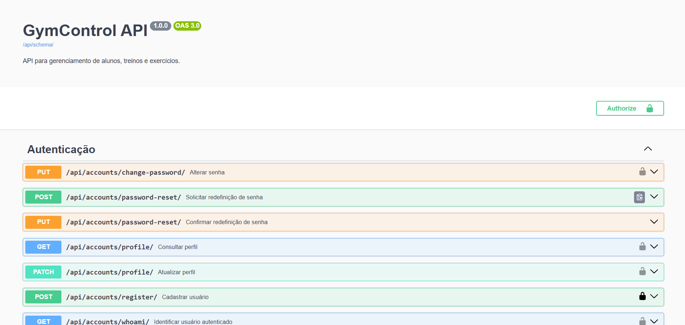
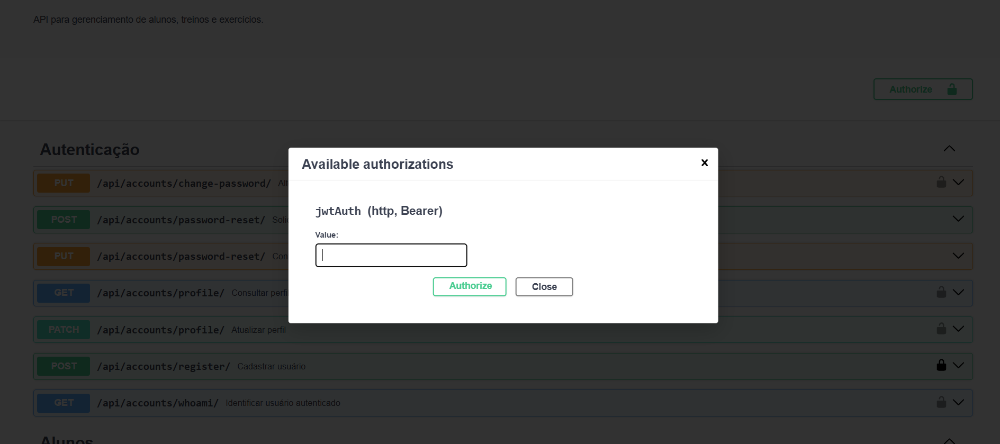
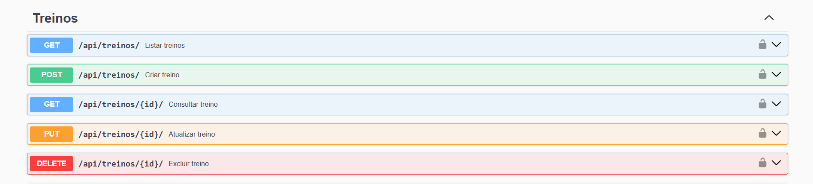

# GymControl — Backend

API REST desenvolvida para o Trabalho 2 da disciplina INF1407.

## Autor

* João Pedro Zaidman dos Santos Gonçalves - 2329464

## Links

* Backend publicado: https://inf-1407-trab2-back.vercel.app/
* Documentação Swagger: https://inf-1407-trab2-back.vercel.app/swagger/
* Repositório do frontend: [\[LINK DO REPOSITÓRIO DO FRONTEND\]](https://github.com/jpxzn/INF1407-Trab2-Front)
* Frontend publicado: [\[LINK DO FRONTEND\]](https://inf-1407-trab2-front.vercel.app/)

## Descrição

O GymControl é um sistema para gerenciamento de alunos, treinos e exercícios de academia.

O backend fornece uma API REST utilizada pelo frontend. A aplicação diferencia usuários administradores e alunos:

* administradores podem visualizar alunos e gerenciar seus treinos;
* alunos podem visualizar somente os próprios treinos;
* usuários autenticados podem consultar e atualizar o próprio perfil;
* usuários podem alterar ou recuperar a senha.

O projeto foi desenvolvido separadamente do frontend, conforme solicitado no enunciado.

## Tecnologias utilizadas

* Python
* Django
* Django REST Framework
* PostgreSQL
* Simple JWT
* drf-spectacular
* Swagger
* django-cors-headers
* Neon PostgreSQL
* Vercel

## Principais funcionalidades

### 🔑 Acesso como Admin

Para acessar como administrador:
- Vá até a página de login
- Utilize:
  - **Usuário:** admin  
  - **Senha:** admin123  

### Autenticação e usuários

* cadastro de aluno;
* login com JWT;
* identificação do usuário autenticado;
* perfil do usuário;
* atualização de perfil;
* alteração de senha;
* recuperação de senha por código temporário;
* permissões diferentes para aluno e administrador.

### Treinos e exercícios

* cadastro, consulta, edição e exclusão de exercícios;
* cadastro, consulta, edição e exclusão de treinos;
* associação de exercícios aos treinos;
* definição de séries e repetições;
* diferentes visões de dados de acordo com o usuário autenticado.

## CRUD

A API implementa as quatro operações básicas:

| Operação  | Método HTTP | Exemplo                      |
| --------- | ----------- | ---------------------------- |
| Criar     | POST        | Criar treino ou exercício    |
| Consultar | GET         | Listar treinos ou exercícios |
| Atualizar | PUT/PATCH   | Alterar treino ou perfil     |
| Excluir   | DELETE      | Remover treino ou exercício  |

## Documentação da API

A API pode ser consultada pelo Swagger:

```text
https://inf-1407-trab2-back.vercel.app/swagger/
```

Também estão disponíveis:

```text
https://inf-1407-trab2-back.vercel.app/api/schema/
https://inf-1407-trab2-back.vercel.app/redoc/
```

### Principais endpoints

| Método         | Endpoint                         | Descrição                         |
| -------------- | -------------------------------- | --------------------------------- |
| POST           | `/api/token/`                    | Realiza login                     |
| POST           | `/api/token/refresh/`            | Atualiza o token                  |
| POST           | `/api/accounts/register/`        | Cadastra um aluno                 |
| GET            | `/api/accounts/whoami/`          | Retorna o usuário autenticado     |
| GET/PATCH      | `/api/accounts/profile/`         | Consulta ou altera o perfil       |
| PUT            | `/api/accounts/change-password/` | Altera a senha                    |
| POST/PUT       | `/api/accounts/password-reset/`  | Recuperação de senha              |
| GET/POST       | `/api/exercicios/`               | Lista ou cria exercícios          |
| GET/PUT/DELETE | `/api/exercicios/{id}/`          | Gerencia um exercício             |
| GET/POST       | `/api/treinos/`                  | Lista ou cria treinos             |
| GET/PUT/DELETE | `/api/treinos/{id}/`             | Gerencia um treino                |
| GET/POST       | `/api/treinos/{id}/exercicios/`  | Gerencia exercícios de um treino  |
| GET            | `/api/alunos/`                   | Lista alunos para o administrador |

## Imagens

### Swagger da API



### Autenticação JWT



### Endpoints de treinos



## Instalação local

### 1. Clonar o repositório

```bash
git clone (https://github.com/jpxzn/INF1407-Trab2-Back)
cd INF1407-Trab2-Back
```

### 2. Criar o ambiente virtual

No Windows:

```powershell
python -m venv .venv
.venv\Scripts\Activate.ps1
```

### 3. Instalar as dependências

```powershell
pip install -r requirements.txt
```

### 4. Criar o arquivo `.env`

Crie um arquivo chamado `.env` na raiz do projeto:

```env
DATABASE_URL=[URL DO BANCO POSTGRESQL]
```


### 5. Aplicar as migrations

```powershell
python manage.py migrate
```

### 6. Criar um administrador

```powershell
python manage.py createsuperuser
```

### 7. Executar o servidor

```powershell
python manage.py runserver
```

A API estará disponível em:

```text
http://127.0.0.1:8000/
```

O Swagger estará disponível em:

```text
http://127.0.0.1:8000/swagger/
```

## Manual de utilização da API

### Realizar login

1. Acesse o Swagger.
2. Abra o endpoint `POST /api/token/`.
3. Informe o nome de usuário e a senha.
4. Copie o token de acesso retornado.
5. Clique em `Authorize`.
6. Autorize as requisições usando o token.

### Consultar os treinos

1. Realize a autenticação.
2. Acesse `GET /api/treinos/`.
3. Um aluno verá somente os próprios treinos.
4. Um administrador verá todos os treinos cadastrados.

### Criar um treino

1. Entre como administrador.
2. Acesse `POST /api/treinos/`.
3. Informe o aluno e o nome do treino.
4. Envie a requisição.

### Adicionar exercício a um treino

1. Entre como administrador.
2. Acesse `POST /api/treinos/{treino_id}/exercicios/`.
3. Informe o exercício, a quantidade de séries e as repetições.
4. Envie a requisição.

### Recuperar a senha

1. Envie o e-mail em `POST /api/accounts/password-reset/`.
2. Copie o código de recuperação exibido nos logs do backend.
3. Envie o código e a nova senha usando `PUT /api/accounts/password-reset/`.
4. Faça login utilizando a nova senha.

## Funcionalidades testadas e funcionando

* [x] cadastro de aluno;
* [x] login com JWT;
* [x] atualização do token;
* [x] endpoint protegido sem token retorna erro;
* [x] aluno visualiza apenas os próprios treinos;
* [x] administrador visualiza os alunos;
* [x] criação de treino;
* [x] consulta de treino;
* [x] edição de treino;
* [x] exclusão de treino;
* [x] cadastro de exercício;
* [x] associação de exercício ao treino;
* [x] atualização do perfil;
* [x] alteração de senha;
* [x] recuperação de senha;
* [x] documentação Swagger.

## Limitações e funcionalidades que não funcionaram

* O envio de recuperação de senha utiliza o backend de e-mail do console.
* O código de recuperação é exibido nos logs do backend e não é enviado para uma caixa de e-mail real.

## Observações de segurança

* As senhas são armazenadas utilizando o sistema de autenticação do Django.
* Endpoints privados exigem autenticação JWT.
* Alunos não podem consultar os treinos de outros alunos.
* Operações administrativas são limitadas a usuários administradores.
* Variáveis sensíveis são configuradas por variáveis de ambiente.

## Estrutura resumida

```text
INF1407-Trab2-Back/
├── accounts/
├── GymControl/
├── config/
├── manage.py
├── requirements.txt
└── README.md
```
